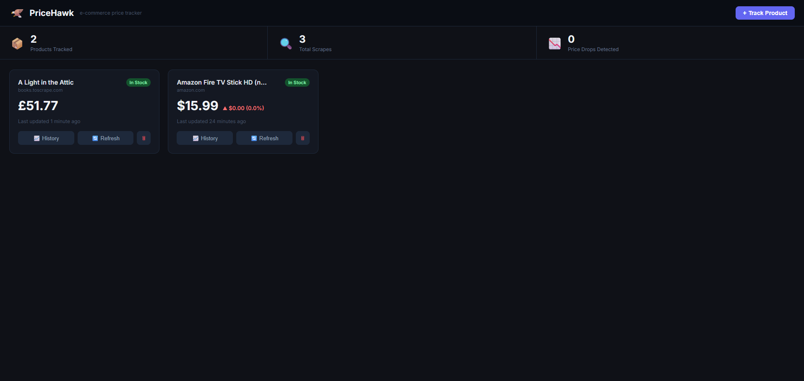

# 🦅 PriceHawk

A full-stack e-commerce price tracker. Add any product URL, configure the CSS selector for the price element, and PriceHawk scrapes and stores the price on a schedule — visualizing the history on a live dashboard.

Amazon requires anti-bot proxy services (like Bright Data or ScraperAPI) so any links from amazon.com may not be accurate.



## Features

- **User authentication** — register/login with email and password, JWT sessions, bcrypt password hashing
- **Per-user data** — each account tracks its own products independently
- **Admin dashboard** — admin accounts can view all registered users and signup times
- **Headless browser scraping** via Puppeteer with anti-detection headers and resource blocking for speed
- **Price history** stored in SQLite with WAL mode for concurrent reads
- **Interactive dashboard** built with React + Recharts — area charts, price delta badges, in-stock indicators
- **Scheduled auto-scraping** via node-cron (configurable interval)
- **Manual refresh** per product with per-endpoint rate limiting
- **REST API** with Helmet security headers, CORS, API key + JWT authentication, and global rate limiting
- Works on any site — supply a CSS selector for the price element

## Tech Stack

| Layer | Technology |
|---|---|
| Scraper | Puppeteer (system Chrome/Edge) |
| Backend | Node.js, Express, node-cron |
| Database | SQLite (sql.js — pure WASM, no native compilation) |
| Auth | JWT (jsonwebtoken), bcrypt |
| Frontend | React 18, Vite, Recharts |
| Styling | CSS Modules |
| Deployment | Vercel (frontend), Cloudflare Tunnel (backend) |

## Project Structure

```
pricehawk/
├── backend/
│   ├── src/
│   │   ├── server.js          # Express app + middleware
│   │   ├── scheduler.js       # node-cron scrape loop
│   │   ├── api/
│   │   │   └── routes.js      # REST endpoints
│   │   ├── db/
│   │   │   └── database.js    # SQLite init + schema
│   │   └── scraper/
│   │       └── scraper.js     # Puppeteer scraper + price parser
│   └── package.json
└── frontend/
    ├── src/
    │   ├── App.jsx
    │   ├── api.js             # Axios API client
    │   └── components/
    │       ├── Navbar.jsx
    │       ├── StatsBar.jsx
    │       ├── ProductCard.jsx
    │       ├── AddProductModal.jsx
    │       └── PriceChartModal.jsx
    └── package.json
```

> **Note:** The frontend is deployed on Vercel. The backend runs locally and is exposed via Cloudflare Tunnel — update `VITE_API_URL` in Vercel each time the tunnel URL changes.

## Getting Started

### Prerequisites

- Node.js 18+
- npm

### 1. Clone the repo

```bash
git clone https://github.com/carterw94/PriceHawk.git
cd pricehawk
```

### 2. Start the backend

```bash
cd backend
npm install
cp .env.example .env   # fill in API_KEY, JWT_SECRET, ADMIN_EMAIL, ADMIN_PASSWORD
npm run dev
# API running at http://localhost:3001
```

### 3. Start the frontend

```bash
cd frontend
npm install
npm run dev
# UI running at http://localhost:5173
```

### 4. Create an account

Open `http://localhost:5173`, click **Create Account**, and register with your email and password. The admin account is seeded automatically from `ADMIN_EMAIL` / `ADMIN_PASSWORD` in your `.env`.

## API Reference

All `/api` routes require an `x-api-key` header and a `Bearer` JWT token. Auth routes only need the API key.

| Method | Endpoint | Auth | Description |
|--------|----------|------|-------------|
| `POST` | `/auth/register` | API key | Create a new account |
| `POST` | `/auth/login` | API key | Login, returns JWT |
| `GET` | `/auth/me` | JWT | Current user info |
| `GET` | `/auth/users` | JWT (admin) | List all users |
| `GET` | `/api/products` | JWT | List your tracked products |
| `POST` | `/api/products` | JWT | Add a product to track |
| `DELETE` | `/api/products/:id` | JWT | Stop tracking a product |
| `GET` | `/api/products/:id/history` | JWT | Price history (`?limit=60`) |
| `POST` | `/api/products/:id/scrape` | JWT | Trigger a manual scrape |
| `GET` | `/api/stats` | JWT | Your dashboard summary stats |
| `GET` | `/health` | — | Health check |

### Add product payload

```json
{
  "url": "https://books.toscrape.com/catalogue/a-light-in-the-attic_1000/index.html",
  "selector_price": ".price_color",
  "selector_title": ".product_main h1",
  "name": "A Light in the Attic"
}
```

## Finding CSS Selectors

1. Open the product page in Chrome/Firefox
2. Right-click the price → **Inspect**
3. In DevTools, right-click the highlighted element → **Copy → Copy selector**
4. Paste into the "Price CSS Selector" field in the app

## How the Scraper Works

1. Launches a headless Chromium instance via Puppeteer
2. Spoofs a real browser User-Agent and `Accept-Language` header
3. Blocks images, fonts, stylesheets, and media to cut load time by ~70%
4. Waits for the price element to appear in the DOM (up to 5s)
5. Extracts and normalises the price string (handles `$`, `€`, `£`, comma-separated thousands)
6. Detects out-of-stock by scanning body text for common phrases
7. Persists the result to SQLite and closes the browser

## Environment Variables

| Variable | Default | Description |
|----------|---------|-------------|
| `PORT` | `3001` | Backend server port |
| `SCRAPE_INTERVAL_MINUTES` | `60` | How often to auto-scrape all products |
| `FRONTEND_URL` | `http://localhost:5173` | Allowed CORS origin (set to your Vercel URL in production) |
| `API_KEY` | — | Secret key required in `x-api-key` header |
| `JWT_SECRET` | — | Secret used to sign JWT tokens (generate with `node -e "console.log(require('crypto').randomBytes(64).toString('hex'))"`) |
| `ADMIN_EMAIL` | — | Email for the auto-seeded admin account |
| `ADMIN_PASSWORD` | — | Password for the auto-seeded admin account |